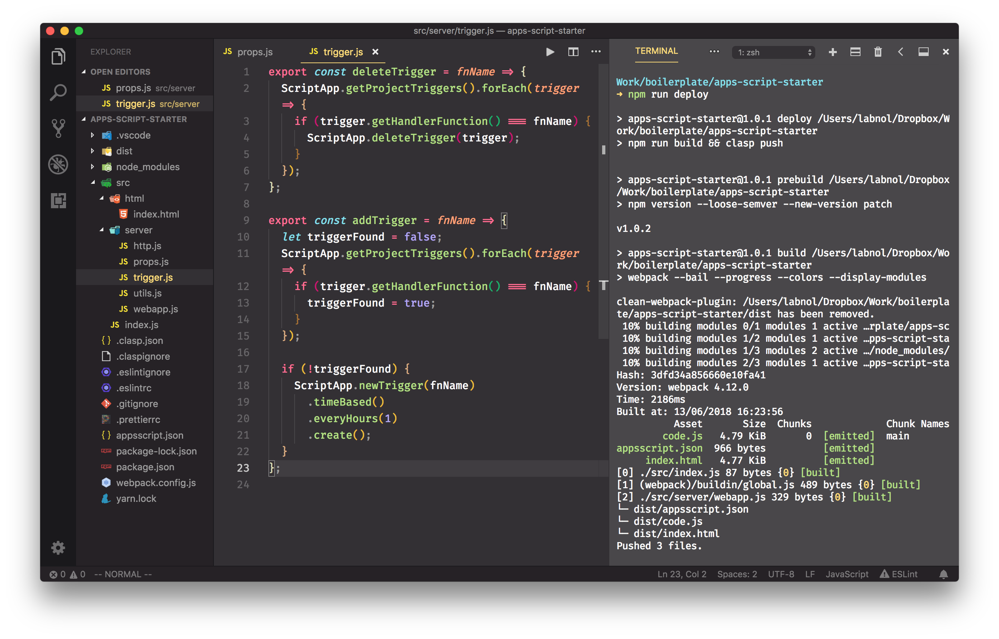

#  crawler-with-google-appscript 💯

The Google Apps Script Starker kit supports the new **V8 JavaScript runtime** that powers Chrome and Node.js. You can write code using modern ECMAScript syntax like Arrow functions, Classes, Template Literals, Destructuring and more.

